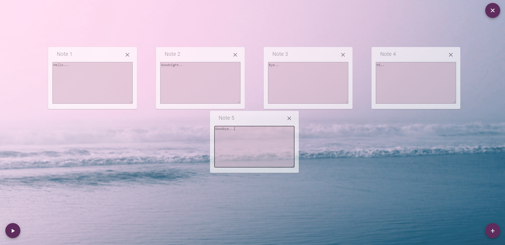

# NotesApp

This project was generated with [Angular CLI](https://github.com/angular/angular-cli) version 11.2.5.

## Development server

- Run `npm install` 
- Run `ng serve` for a dev server
- Navigate to `http://localhost:4200/`. The app will automatically reload if you change any of the source files.

## Description

The **Notes App** is a simple project about **adding** and **deleting notes**. The main idea was understanding and getting familiar with 
**Angular** and **Material Design**. More specifically, the **basic features** are the following:

  ### Play/Stop audio file  
  
  
  
  ### Add notes into a flex-box    
  
  
  
  ### Delete a specific note
  
  
  
  ### Delete all notes and inform the user via a toaster 
  
  
  
  ### Scroll on top
  
  
 
  * Τhe app is fully responsive

   
